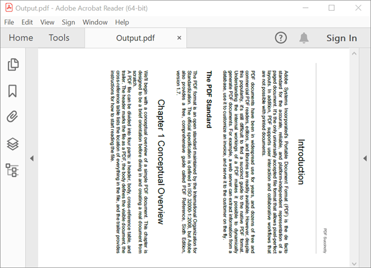
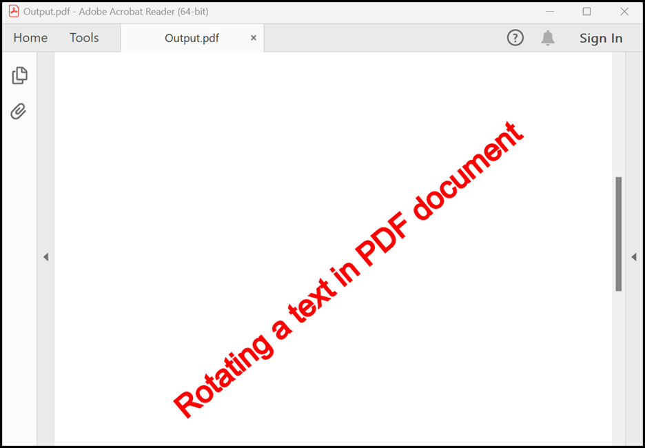
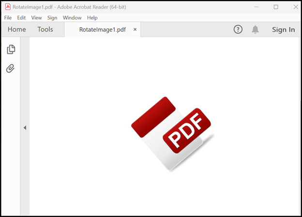
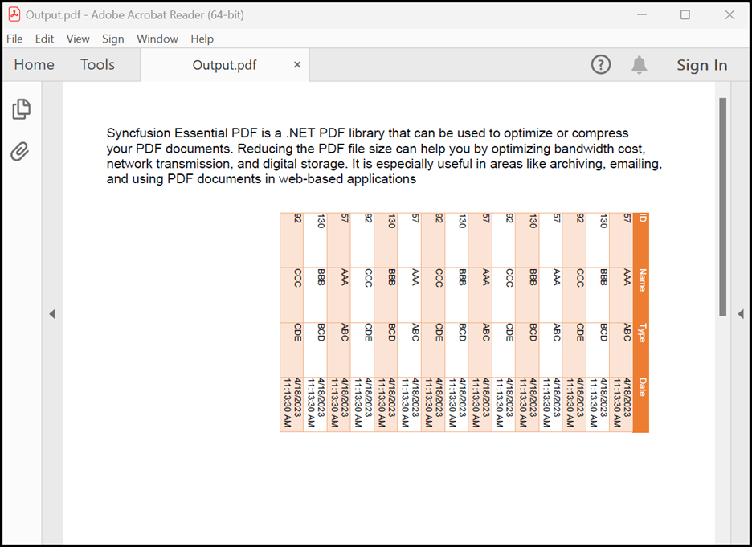

# Rotating a PDF using .Net Console

The [Syncfusion&reg; PDF Library](https://www.syncfusion.com/document-processing/pdf-framework/net/pdf-library) provides support to rotating a PDF document. The library also provides APIs for changing the orientation of a PDF document by a specified degree.

This article will cover the process to rotate a page, text, image and table from a PDF document using the Syncfusion&reg; .NET PDF library. The topics related to this will be discussed in the following sections of this post:

Name | Description
--- | ---
[Rotating a page in PDF](https://github.com/SyncfusionExamples/rotating-a-PDF-document-using-csharp/tree/master/RotatePDFPage) | It means changing the orientation of the page by a specified degree.
[Rotating a text in PDF](https://github.com/SyncfusionExamples/rotating-a-PDF-document-using-csharp/tree/master/RotatePDFText) | It means changing the orientation of the text by a specified degree.
[Rotating an image in PDF](https://github.com/SyncfusionExamples/rotating-a-PDF-document-using-csharp/tree/master/RotatePDFImage) | It means changing the orientation of the image by a specified degree.
[Rotating a Table in PDF](https://github.com/SyncfusionExamples/rotating-a-PDF-document-using-csharp/tree/master/RotatePDFTable) | It means changing the orientation of the table by a specified degree.


## Rotating a page in PDF using C#

Rotating a PDF page means changing the orientation of the page by a specified degree.

The following code example shows how to rotate a page to a PDF file using C#.

```csharp
//Load PDF document as stream.  
FileStream inputStream = new FileStream("Input.pdf", FileMode.Open, FileAccess.Read, FileShare.ReadWrite); 
//Load the existing PDF document.  
PdfLoadedDocument loadedDocument = new PdfLoadedDocument(inputStream); 
for (int i = 0; i < loadedDocument.PageCount; i++) 
{ 
    //Gets the page. 
    PdfPageBase loadedPage = loadedDocument.Pages[i] as PdfPageBase; 
    //Set the rotation for loaded page.  
    loadedPage.Rotation = PdfPageRotateAngle.RotateAngle90; 
} 
//Create the filestream to save the PDF document.   
using(FileStream fileStream = new FileStream("Output.pdf", FileMode.CreateNew, FileAccess.ReadWrite)) 
{ 
loadedDocument.Save(fileStream); 
} 
//Close the document.  
loadedDocument.Close(true); 
```
By executing this code example, you will get a PDF document like the following screenshot.




## Rotating a text in PDF using C#

Rotating a PDF text means changing the orientation of the text by a specified degree.

The following code example shows how to rotate a text to a PDF file using C#.

```csharp
//Create a new PDF document. 
PdfDocument pdfDocument = new PdfDocument(); 
//Add a page to the PDF document. 
PdfPage pdfPage = pdfDocument.Pages.Add(); 
//Create PDF graphics for the page. 
PdfGraphics graphics = pdfPage.Graphics; 
//Set the font. 
PdfFont font = new PdfStandardFont(PdfFontFamily.Helvetica, 20); 
//Add watermark text. 
PdfGraphicsState state = graphics.Save(); 
graphics.RotateTransform(-40); 
graphics.DrawString("Rotating a text in PDF document", font, PdfPens.Red, PdfBrushes.Red, new PointF(-150, 450)); 

//Create the filestream to save the PDF document.  
FileStream fileStream = new FileStream("Output.pdf", FileMode.CreateNew, FileAccess.ReadWrite); 
pdfDocument.Save(fileStream); 
//Close the document. 
pdfDocument.Close(true);
```
By executing this code example, you will get a PDF document like the following screenshot.



## Rotating an image in PDF using C#

Rotating a PDF image means changing the orientation of the image by a specified degree.

The following code example shows how to rotate an image to a PDF file using C#.

```csharp
//Created the PDF document. 
PdfDocument document = new PdfDocument(); 
//Add a new page 
PdfPage page = document.Pages.Add(); 
FileStream imageStream = new FileStream("Input.png", FileMode.Open, FileAccess.Read, FileShare.ReadWrite); 
//Load a bitmap 
PdfBitmap image = new PdfBitmap(imageStream); 
//save the current graphics state 
PdfGraphicsState state = page.Graphics.Save(); 
//Rotate the coordinate system 
page.Graphics.RotateTransform(-40); 
//Draw image 
image.Draw(page, -150, 450); 
//Restore the graphics state 
page.Graphics.Restore(state); 

//Create the filestream to save the PDF document.  
FileStream fileStream = new FileStream("Output.pdf", FileMode.CreateNew, FileAccess.ReadWrite); 
document.Save(fileStream); 
//Close the document. 
document.Close(true); 
```
By executing this code example, you will get a PDF document like the following screenshot.



## Rotating a table in PDF using C#

Rotating a PDF table means changing the orientation of the table by a specified degree.

The following code example shows how to rotate an table to a PDF file using C#.

```csharp
//Create a new PDF document. 
PdfDocument document = new PdfDocument(); 
//Add a page. 
PdfPage page = document.Pages.Add(); 
//Create a PdfGrid. 
PdfGrid pdfGrid = new PdfGrid(); 
//Add a handler to rotate the table. 
pdfGrid.BeginPageLayout += PdfGrid_BeginPageLayout; 
//Create a DataTable. 
DataTable dataTable = new DataTable(); 

//Add columns to the DataTable. 
dataTable.Columns.Add("ID", typeof(int)); 
dataTable.Columns.Add("Name", typeof(string)); 
dataTable.Columns.Add("Type", typeof(string)); 
dataTable.Columns.Add("Date", typeof(DateTime)); 
//Add rows to the DataTable. 
for (int i = 0; i < 10; i++) 
{ 
    dataTable.Rows.Add(57, "AAA", "ABC", DateTime.Now); 
    dataTable.Rows.Add(130, "BBB", "BCD", DateTime.Now); 
    dataTable.Rows.Add(92, "CCC", "CDE", DateTime.Now); 
} 
//Assign data source. 
pdfGrid.DataSource = dataTable; 
//Set a repeat header for the table.  
pdfGrid.RepeatHeader = true; 
//Draw a grid to the page of a PDF document. 
pdfGrid.Draw(page, new RectangleF(100, 20, 0, page.GetClientSize().Width)); 

//Create the filestream to save the PDF document.  
FileStream fileStream = new FileStream("Output.pdf", FileMode.CreateNew, FileAccess.ReadWrite); 
document.Save(fileStream); 
//Close the document. 
document.Close(true); 
 

void PdfGrid_BeginPageLayout(object sender, Syncfusion.Pdf.Graphics.BeginPageLayoutEventArgs e) 
{ 
    PdfPage page = e.Page; 
    PdfGraphics graphics = e.Page.Graphics; 
    //Translate the coordinate system to the required position. 
    graphics.TranslateTransform(page.GetClientSize().Width, 0); 
    //Rotate the coordinate system. 
    graphics.RotateTransform(90); 
} 
```
By executing this code example, you will get a PDF document like the following screenshot.




# How to run the examples
* Download this project to a location in your disk. 
* Open the solution file using Visual Studio. 
* Rebuild the solution to install the required NuGet package. 
* Run the application.

# Resources
*   **Product page:** [Syncfusion&reg; PDF Framework](https://www.syncfusion.com/document-processing/pdf-framework/net)
*   **Documentation page:** [Syncfusion&reg; .NET PDF library](https://help.syncfusion.com/file-formats/pdf/overview)
*   **Online demo:** [Syncfusion&reg; .NET PDF library - Online demos](https://ej2.syncfusion.com/aspnetcore/PDF/CompressExistingPDF#/bootstrap5)
*   **Blog:** [Syncfusion&reg; .NET PDF library - Blog](https://www.syncfusion.com/blogs/category/pdf)
*   **Knowledge Base:** [Syncfusion&reg; .NET PDF library - Knowledge Base](https://www.syncfusion.com/kb/windowsforms/pdf)
*   **EBooks:** [Syncfusion&reg; .NET PDF library - EBooks](https://www.syncfusion.com/succinctly-free-ebooks)
*   **FAQ:** [Syncfusion&reg; .NET PDF library - FAQ](https://www.syncfusion.com/faq/)

# Support and feedback
*   For any other queries, reach our [Syncfusion&reg; support team](https://www.syncfusion.com/support/directtrac/incidents/newincident?utm_source=github&utm_medium=listing&utm_campaign=github-docio-examples) or post the queries through the [community forums](https://www.syncfusion.com/forums?utm_source=github&utm_medium=listing&utm_campaign=github-docio-examples).
*   Request new feature through [Syncfusion&reg; feedback portal](https://www.syncfusion.com/feedback?utm_source=github&utm_medium=listing&utm_campaign=github-docio-examples).

# License
This is a commercial product and requires a paid license for possession or use. Syncfusion’s licensed software, including this component, is subject to the terms and conditions of [Syncfusion's EULA](https://www.syncfusion.com/eula/es/?utm_source=github&utm_medium=listing&utm_campaign=github-docio-examples). You can purchase a licnense [here](https://www.syncfusion.com/sales/products?utm_source=github&utm_medium=listing&utm_campaign=github-docio-examples) or start a free 30-day trial [here](https://www.syncfusion.com/account/manage-trials/start-trials?utm_source=github&utm_medium=listing&utm_campaign=github-docio-examples).

# About Syncfusion&reg;
Founded in 2001 and headquartered in Research Triangle Park, N.C., Syncfusion&reg; has more than 26,000+ customers and more than 1 million users, including large financial institutions, Fortune 500 companies, and global IT consultancies.

Today, we provide 1600+ components and frameworks for web ([Blazor](https://www.syncfusion.com/blazor-components?utm_source=github&utm_medium=listing&utm_campaign=github-docio-examples), [ASP.NET Core](https://www.syncfusion.com/aspnet-core-ui-controls?utm_source=github&utm_medium=listing&utm_campaign=github-docio-examples), [ASP.NET MVC](https://www.syncfusion.com/aspnet-mvc-ui-controls?utm_source=github&utm_medium=listing&utm_campaign=github-docio-examples), [ASP.NET WebForms](https://www.syncfusion.com/jquery/aspnet-webforms-ui-controls?utm_source=github&utm_medium=listing&utm_campaign=github-docio-examples), [JavaScript](https://www.syncfusion.com/javascript-ui-controls?utm_source=github&utm_medium=listing&utm_campaign=github-docio-examples), [Angular](https://www.syncfusion.com/angular-ui-components?utm_source=github&utm_medium=listing&utm_campaign=github-docio-examples), [React](https://www.syncfusion.com/react-ui-components?utm_source=github&utm_medium=listing&utm_campaign=github-docio-examples), [Vue](https://www.syncfusion.com/vue-ui-components?utm_source=github&utm_medium=listing&utm_campaign=github-docio-examples), and [Flutter](https://www.syncfusion.com/flutter-widgets?utm_source=github&utm_medium=listing&utm_campaign=github-docio-examples)), mobile ([Xamarin](https://www.syncfusion.com/xamarin-ui-controls?utm_source=github&utm_medium=listing&utm_campaign=github-docio-examples), [Flutter](https://www.syncfusion.com/flutter-widgets?utm_source=github&utm_medium=listing&utm_campaign=github-docio-examples), [UWP](https://www.syncfusion.com/uwp-ui-controls?utm_source=github&utm_medium=listing&utm_campaign=github-docio-examples), and [JavaScript](https://www.syncfusion.com/javascript-ui-controls?utm_source=github&utm_medium=listing&utm_campaign=github-docio-examples)), and desktop development ([WinForms](https://www.syncfusion.com/winforms-ui-controls?utm_source=github&utm_medium=listing&utm_campaign=github-docio-examples), [WPF](https://www.syncfusion.com/wpf-ui-controls?utm_source=github&utm_medium=listing&utm_campaign=github-docio-examples), [WinUI(Preview)](https://www.syncfusion.com/winui-controls?utm_source=github&utm_medium=listing&utm_campaign=github-docio-examples), [Flutter](https://www.syncfusion.com/flutter-widgets?utm_source=github&utm_medium=listing&utm_campaign=github-docio-examples) and [UWP](https://www.syncfusion.com/uwp-ui-controls?utm_source=github&utm_medium=listing&utm_campaign=github-docio-examples)). We provide ready-to-deploy enterprise software for dashboards, reports, data integration, and big data processing. Many customers have saved millions in licensing fees by deploying our software.


